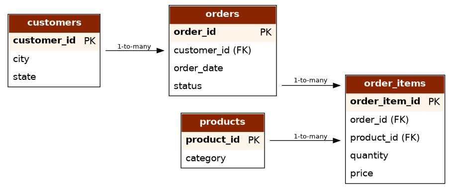
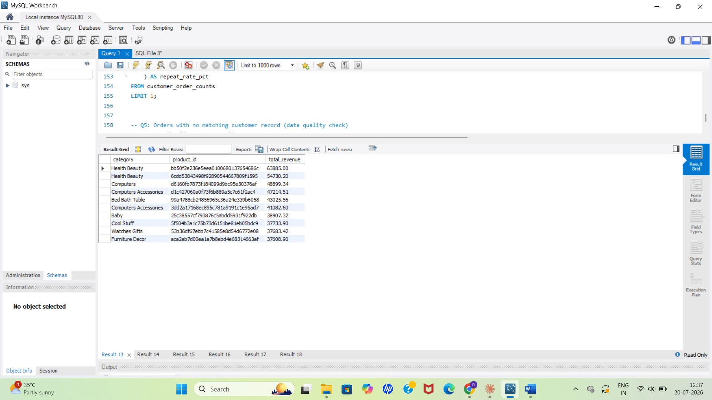
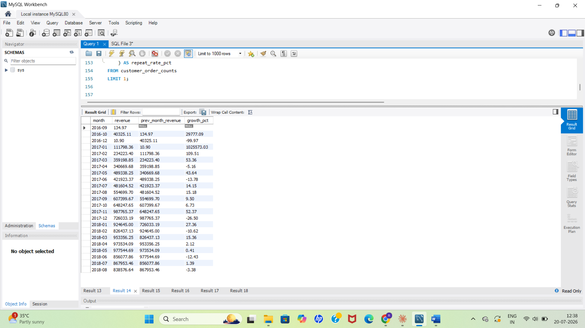
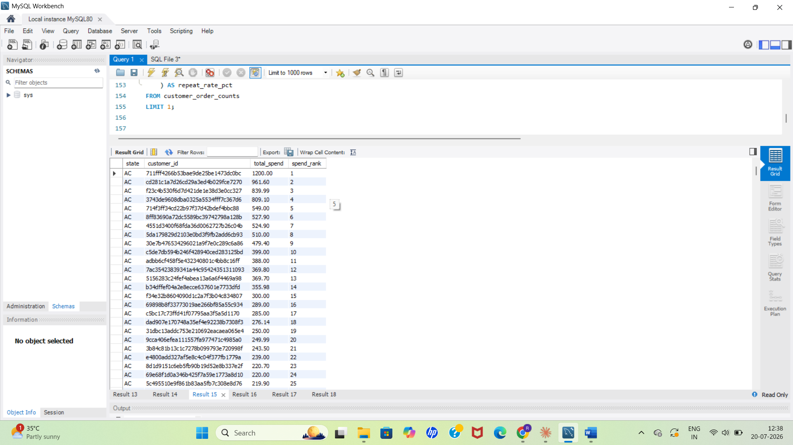
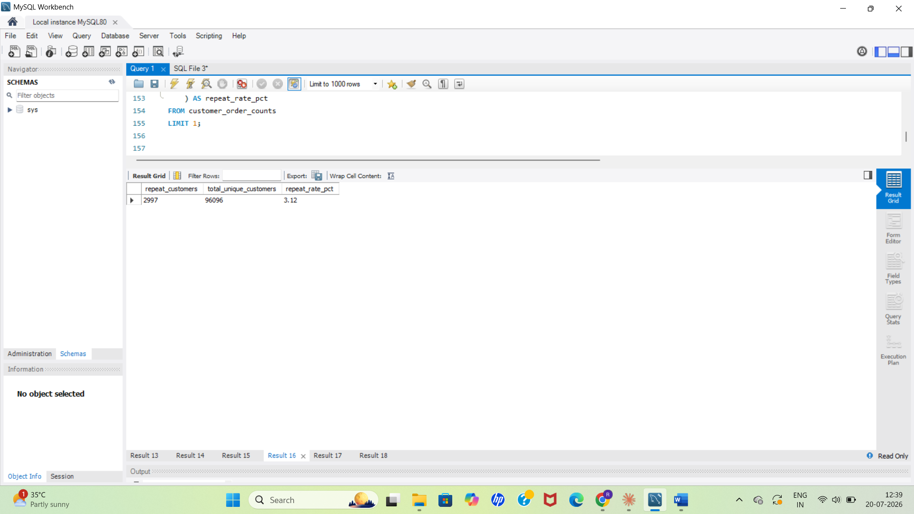
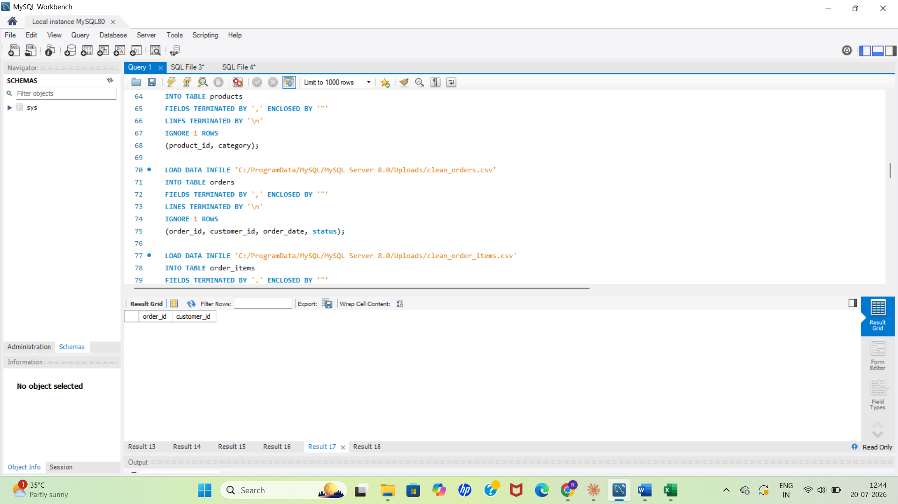
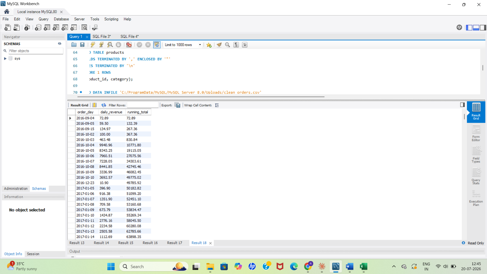

# E-Commerce Sales Analytics — SQL Project

## Overview
An end-to-end SQL analytics project built on real-world e-commerce transaction data, answering business questions a Data Analyst would typically be asked to solve — revenue trends, customer ranking, repeat purchase behavior, and data quality checks.

## Dataset
[Brazilian E-Commerce Public Dataset by Olist](https://www.kaggle.com/datasets/olistbr/brazilian-ecommerce) (Kaggle) — real, anonymized commercial data covering 99,441 orders placed between 2016–2018.

| Table | Rows |
|---|---|
| customers | 99,441 |
| products | 32,951 |
| orders | 99,441 |
| order_items | 112,650 |

## Tech Stack
MySQL 8.0 (window functions, CTEs) · MySQL Workbench

## ER Diagram


## Schema
- **customers** — customer_id, customer_unique_id, city, state
- **products** — product_id, category
- **orders** — order_id, customer_id, order_date, status
- **order_items** — order_item_id, order_id, product_id, quantity, price

## Business Questions & Queries

### 1. Top 10 products by total revenue
```sql
SELECT p.category, p.product_id, SUM(oi.quantity * oi.price) AS total_revenue
FROM order_items oi
JOIN products p ON oi.product_id = p.product_id
GROUP BY p.product_id, p.category
ORDER BY total_revenue DESC
LIMIT 10;
```


### 2. Monthly revenue growth %
Uses a CTE + `LAG()` window function to compare each month's revenue against the previous month.
```sql
WITH monthly_revenue AS (
    SELECT DATE_FORMAT(o.order_date, '%Y-%m') AS month,
           SUM(oi.quantity * oi.price) AS revenue
    FROM orders o
    JOIN order_items oi ON o.order_id = oi.order_id
    WHERE o.status = 'delivered'
    GROUP BY DATE_FORMAT(o.order_date, '%Y-%m')
)
SELECT month, revenue,
       LAG(revenue) OVER (ORDER BY month) AS prev_month_revenue,
       ROUND((revenue - LAG(revenue) OVER (ORDER BY month))
             / LAG(revenue) OVER (ORDER BY month) * 100, 2) AS growth_pct
FROM monthly_revenue
ORDER BY month;
```


### 3. Rank customers by total spend within each state
Uses `RANK() OVER (PARTITION BY state ...)` to rank customers separately per state rather than nationally.
```sql
SELECT c.state, c.customer_id,
       SUM(oi.quantity * oi.price) AS total_spend,
       RANK() OVER (PARTITION BY c.state ORDER BY SUM(oi.quantity * oi.price) DESC) AS spend_rank
FROM customers c
JOIN orders o ON c.customer_id = o.customer_id
JOIN order_items oi ON o.order_id = oi.order_id
GROUP BY c.state, c.customer_id;
```


### 4. Repeat customer rate
Calculates the % of customers who placed more than one order. Uses `customer_unique_id` rather than `customer_id`, since Olist generates a fresh `customer_id` per order — `customer_unique_id` is the true per-person identifier needed to detect repeat behavior.
```sql
WITH customer_order_counts AS (
    SELECT c.customer_unique_id, COUNT(DISTINCT o.order_id) AS num_orders
    FROM orders o
    JOIN customers c ON o.customer_id = c.customer_id
    GROUP BY c.customer_unique_id
)
SELECT
    (SELECT COUNT(*) FROM customer_order_counts WHERE num_orders > 1) AS repeat_customers,
    (SELECT COUNT(*) FROM customer_order_counts) AS total_unique_customers,
    ROUND((SELECT COUNT(*) FROM customer_order_counts WHERE num_orders > 1) * 100.0
          / (SELECT COUNT(*) FROM customer_order_counts), 2) AS repeat_rate_pct
FROM customer_order_counts
LIMIT 1;
```


### 5. Orders with no matching customer record (data quality check)
A `LEFT JOIN` + `IS NULL` check to catch orphaned records.
```sql
SELECT o.order_id, o.customer_id
FROM orders o
LEFT JOIN customers c ON o.customer_id = c.customer_id
WHERE c.customer_id IS NULL;
```


### 6. Running total of daily revenue
Uses `SUM() OVER (ORDER BY ...)` to build a cumulative revenue trend across the full dataset.
```sql
SELECT DATE(o.order_date) AS order_day,
       SUM(oi.quantity * oi.price) AS daily_revenue,
       SUM(SUM(oi.quantity * oi.price)) OVER (ORDER BY DATE(o.order_date)) AS running_total
FROM orders o
JOIN order_items oi ON o.order_id = oi.order_id
GROUP BY DATE(o.order_date)
ORDER BY order_day;
```


## Key Findings
- **Health & Beauty** was the top-grossing category, generating ₹63,885 in total revenue — nearly ₹9,000 ahead of the next-closest category.
- Revenue growth was extremely volatile in late 2016 due to Olist's negligible test-order volume before its real 2017 launch; month-over-month trends are far more meaningful from **2017 onward**.
- The **repeat purchase rate was just 3.12%** (2,997 of 96,096 unique customers), consistent with Olist's marketplace model — many small independent sellers rather than a single retail brand customers return to.
- A `LEFT JOIN` data quality check confirmed **zero orphaned orders**, meaning every order maps to a valid customer record.

## What I'd Add With More Time
Stored procedures for repeatable reporting, indexing on `order_date` and `customer_id` for query optimization on larger datasets, and a Power BI dashboard layered on top of these queries for a non-technical stakeholder view.

## How to Run
1. Run the CREATE TABLE statements in `ecommerce_real_data_project_FINAL.sql`
2. Import the 4 `clean_*.csv` files (via LOAD DATA INFILE or Workbench's Import Wizard)
3. Run the 6 queries at the bottom of the script
